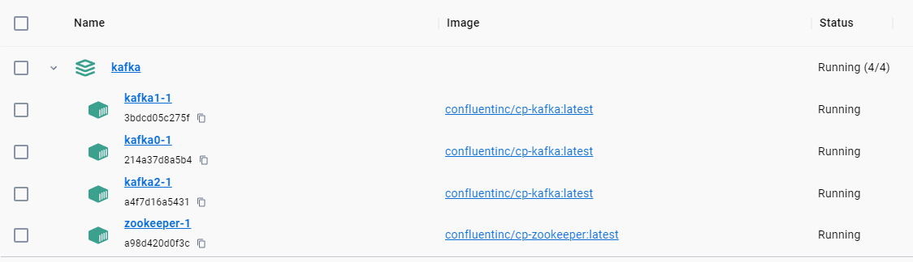

# Overview

This repository contains a docker compose deployment configuration for a Kafka service based on `Confluent image`. This configuration is made up of three Kafka brokers and one Zookeeper. Java Authentication and Authorization Service `(JAAS)` is used for `SASL_PLAINTEXT` username and password authentication without an SSL certificate.

# Directory Tree

    .
    ├── configs
    │   ├── env.dev
    │   └── kafka_server_jaas.conf
    ├── Resources
    │   ├── docker-output.png
    ├── KAFKA_SASL_PLAINTEXT-docker-compose.yml
    ├── LICENSE
    └── README.md
# Configuration

You may create multiple environment files such as env.dev and env.prod. The file contains some configurations for your docker deployment and its made possible using docker compose.

Variable                 | Default Value          | Used For?
-------------------------| -----------------------| -------------
PUBLIC_IP                | localhost              | Network interface
SECURITY_PROTOCOL        | SASL_PLAINTEXT         | PLAINTEXT, SSL, SASL_PLAINTEXT, SASL_SSL
ZOOKEEPER_IMAGE_TAG      | latest                 | Confluent Zookeeper image version
KAFKA_IMAGE_TAG          | latest                 | Confluent Kafka image version
KAFKA_BROKER_N_PORT      | 9093-9095              | Kafka brokers ports

# Authentication

In this configuration we are using `SASL_PLAINTEXT` user and passwor configuration to authenticate with the service. By default JAAS is used. In order to tell JAAS how to authorize clients, `kafka_server_jaas.conf` should be configured. This configuration file is going to mounted inside a voluem in directory `/etc/kafka/configs`. `PlainLoginModule` has been used for `SASL_PLAINTEXT` auth.

Variable                 | Default Value          | Note
-------------------------| -----------------------| -------------
username                 | theengineroom          | User Name to be used for Auth
password                 | 1tY=ZP43t20            | Password to be used for Auth
user_`username`          | 1tY=ZP43t20            | `username` should be replaced with the actual username(theengineroom)

# Deploying

You can simply deploy your configuration using docker compose by using this command:
`docker-compose --env-file ./configs/env.dev -f KAFKA_SASL_PLAINTEXT-docker-compose.yml up`

<h1 align="Left">
  
</h1>

# Find it helpful?

Give us a ⭐️!

# License

Licensed under Apache 2.0 [License](LICENSE).